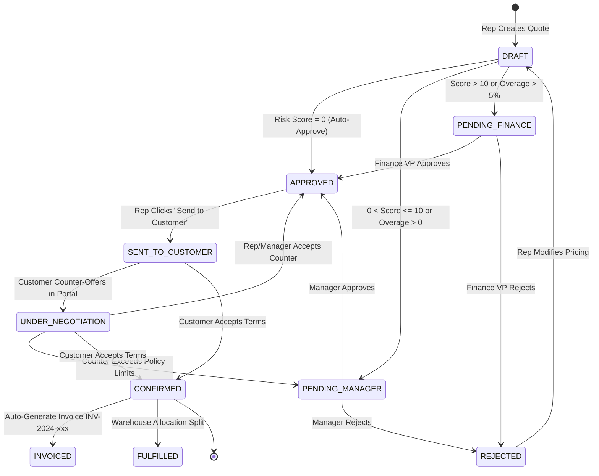

# DealFlow360 — Mathematical Engine & Workflow Architecture
> **Comprehensive Guide for Technical Presentation & Judge Defense**  
> *Author: DealFlow360 Core Engineering Team*

---

## Table of Contents
1. [Executive Summary: The Mathematical Philosophy (30-Second Judge Pitch)](#1-executive-summary-the-mathematical-philosophy)
2. [Core Financial Mathematics & Formulas](#2-core-financial-mathematics--formulas)
   - [2.1 Line-Level Arithmetic (Unit, Discount, Tax, COGS, Line Margin)](#21-line-level-arithmetic)
   - [2.2 Quotation-Level Order Aggregations](#22-quotation-level-order-aggregations)
   - [2.3 Gross Margin vs Markup Difference](#23-gross-margin-vs-markup-difference)
3. [The Blended Risk Engine (The Crown Jewel Algorithm)](#3-the-blended-risk-engine)
   - [3.1 Customer Tiers & Category Ceilings](#31-customer-tiers--category-ceilings)
   - [3.2 The Governing Conservative Minimum Rule](#32-the-governing-conservative-minimum-rule)
   - [3.3 Revenue-Weighted Overage Formula](#33-revenue-weighted-overage-formula)
   - [3.4 Three-Tier Approval Threshold Matrix](#34-three-tier-approval-threshold-matrix)
4. [Step-by-Step Worked Numerical Example (With Real Numbers)](#4-step-by-step-worked-numerical-example)
5. [Smart Fulfillment & Inventory Allocation Mathematics](#5-smart-fulfillment--inventory-allocation-mathematics)
   - [5.1 Available-to-Promise (ATP) Formula](#51-available-to-promise-atp-formula)
   - [5.2 Cost-Optimal Greedy Split Algorithm](#52-cost-optimal-greedy-split-algorithm)
   - [5.3 Backorder Computation](#53-backorder-computation)
6. [Upsell Recommendation & Margin Delta Math](#6-upsell-recommendation--margin-delta-math)
7. [Quotation State Machine & Complete Workflow](#7-quotation-state-machine--complete-workflow)
   - [7.1 State Machine Lifecycle Diagram](#71-state-machine-lifecycle-diagram)
   - [7.2 How "Confirm", "Pending", "Approve", and "Negotiate" Work](#72-how-confirm-pending-approve-and-negotiate-work)
   - [7.3 Downstream Actions on Confirmation (Invoicing & Fulfillment)](#73-downstream-actions-on-confirmation)
   - [7.4 Real-Time WebSocket Event Topology](#74-real-time-websocket-event-topology)
8. [Role Permission Matrix](#8-role-permission-matrix)
9. [Judge Q&A Defense Script (7 High-Frequency Questions & Winning Answers)](#9-judge-qa-defense-script)

---

## 1. Executive Summary: The Mathematical Philosophy

### The Core Problem in Enterprise B2B Sales
In traditional enterprise sales, **Sales Representatives are incentivized purely on Top-Line Volume (Gross Revenue)**, while the company survives on **Bottom-Line Profitability (Gross Margin)**. Reps routinely offer unapproved 20–30% discounts to quickly close deals, silently wiping out company profits without oversight.

### The DealFlow360 Solution
DealFlow360 introduces **Automated Algorithmic Deal Governance**:
1. **Real-time Margin Protection**: Every keystroke recalculates blended gross margin and cost-of-goods-sold (COGS).
2. **Revenue-Weighted Blended Risk Engine**: Discounter risk is weighted by deal value. A 5% discount on a $500,000 server cluster triggers strict executive audit, while 5% on a $50 cable does not.
3. **Deterministic Governance State Machine**: Deals automatically route into Level 1 (Sales Manager) or Level 2 (Finance VP) approval queues based on mathematical thresholds before reaching the customer.
4. **Frictionless Customer Portal & Digital Confirmation**: Secure tokenized negotiation rooms allow live counter-offers with real-time recalculations, culminating in 1-click legal digital confirmation and immediate automated invoice dispatch.

```
[Sales Rep Quotes] ──(Live Math)──> [Blended Risk Engine] ──(Threshold Gate)──> [Approval Queue]
                                                                                       │ (Approved)
[Customer Portal] <──(Token Link)── [Sent to Customer] <─────────────────────────────────┘
       │
   (Negotiate / Counter-Offer) ──> [Socket.io Live Sync] ──> [Rep Counter / Re-approve]
       │
   (Confirm Order)
       │
       ├──> [Auto-Generate Invoice INV-2024-xxx]
       ├──> [Smart Multi-Warehouse Stock Split & Reservation]
       └──> [Immutable Audit Log Recorded]
```

---

## 2. Core Financial Mathematics & Formulas

Every calculation in DealFlow360 is implemented with deterministic precision in both backend (`backend/app/utils/blended_risk_engine.py`) and frontend (`frontend/src/pages/workspace/QuotationBuilder.jsx`).

### 2.1 Line-Level Arithmetic

For each line item $i$ in a quotation:

| Variable | Notation | Definition / Source |
| :--- | :--- | :--- |
| **Quantity** | $Q_i$ | Number of units requested (integer $\ge 1$) |
| **Unit Price** | $P_i$ | Catalog selling price per unit from PriceList |
| **Cost Price** | $C_i$ | Unit Cost of Goods Sold (COGS) to the business |
| **Discount %** | $D_i$ | Percentage discount entered by rep or negotiated ($0 \le D_i \le 100$) |
| **Tax Rate %** | $T_i$ | Applicable GST / VAT rate (e.g., $18\%$ standard) |

#### 1. Gross Line Subtotal ($\text{BaseLineTotal}_i$)
$$\text{BaseLineTotal}_i = Q_i \times P_i$$

#### 2. Line Discount Amount ($\text{DiscountValue}_i$)
$$\text{DiscountValue}_i = \text{BaseLineTotal}_i \times \left(\frac{D_i}{100}\right)$$

#### 3. Net Line Revenue ($\text{AfterDiscount}_i$)
The money the business actually earns before tax:
$$\text{AfterDiscount}_i = \text{BaseLineTotal}_i - \text{DiscountValue}_i = Q_i \times P_i \times \left(1 - \frac{D_i}{100}\right)$$

#### 4. Line Tax Amount ($\text{TaxValue}_i$)
Tax is computed **strictly on the net discounted revenue** (taxing after discount complies with international GST/VAT regulations):
$$\text{TaxValue}_i = \text{AfterDiscount}_i \times \left(\frac{T_i}{100}\right)$$

#### 5. Final Line Total ($\text{LineTotal}_i$)
$$\text{LineTotal}_i = \text{AfterDiscount}_i + \text{TaxValue}_i$$

#### 6. Total Line COGS ($\text{LineCost}_i$)
$$\text{LineCost}_i = Q_i \times C_i$$

#### 7. Line Gross Margin % ($\text{Margin}_i$)
Gross margin measures how much profit remains from revenue after deducting manufacturing / procurement costs:
$$\text{Margin}_i = \begin{cases} 
\left(\dfrac{\text{AfterDiscount}_i - \text{LineCost}_i}{\text{AfterDiscount}_i}\right) \times 100 & \text{if } \text{AfterDiscount}_i > 0 \\ 
0 & \text{otherwise} 
\end{cases}$$

---

### 2.2 Quotation-Level Order Aggregations

When aggregating $N$ line items into a complete commercial quote:

#### 1. Quotation Subtotal ($\text{Subtotal}$)
$$\text{Subtotal} = \sum_{i=1}^{N} \text{BaseLineTotal}_i = \sum_{i=1}^{N} (Q_i \times P_i)$$

#### 2. Quotation Total Discount ($\text{DiscountAmount}$)
$$\text{DiscountAmount} = \sum_{i=1}^{N} \text{DiscountValue}_i$$

#### 3. Quotation Net Revenue ($\text{NetTotal}$)
$$\text{NetTotal} = \text{Subtotal} - \text{DiscountAmount}$$

#### 4. Quotation Tax Amount ($\text{TaxAmount}$)
$$\text{TaxAmount} = \sum_{i=1}^{N} \text{TaxValue}_i$$

#### 5. Grand Invoice Payable Total ($\text{Total}$)
$$\text{Total} = \text{NetTotal} + \text{TaxAmount} = (\text{Subtotal} - \text{DiscountAmount}) + \text{TaxAmount}$$

#### 6. Quotation Overall Gross Margin % ($\text{OverallMargin}$)
$$\text{OverallMargin} = \left(\frac{\text{NetTotal} - \sum_{i=1}^N \text{LineCost}_i}{\text{NetTotal}}\right) \times 100$$

---

### 2.3 Gross Margin vs Markup Difference
> **Key Judge Talking Point**: Many amateurs confuse **Markup** with **Margin**. DealFlow360 calculates strict **Gross Margin**.

- **Gross Margin**: Profit as a percentage of **Selling Revenue**:
  $$\text{Margin} = \frac{\text{Selling Price} - \text{Cost}}{\text{Selling Price}} \times 100$$
- **Markup**: Profit as a percentage of **Cost**:
  $$\text{Markup} = \frac{\text{Selling Price} - \text{Cost}}{\text{Cost}} \times 100$$
- *Example*: Buy for $\$60$, Sell for $\$100$. Profit is $\$40$.
  - Markup is $\frac{40}{60} = 66.7\%$.
  - Margin is $\frac{40}{100} = 40.0\%$.  
  DealFlow360 tracks **Margin** because executives evaluate corporate returns against total top-line earnings.

---

## 3. The Blended Risk Engine

The Blended Risk Engine (`backend/src/utils/blendedRiskEngine.js`) is DealFlow360's proprietary algorithm for quantifying discount compliance.

### 3.1 Customer Tiers & Category Ceilings

Discounts are bounded by two dimensions:

1. **Customer Tier Limits** (`TIER_MAX_DISCOUNT`):
   - **BRONZE**: Maximum **$5\%$** discount allowed
   - **SILVER**: Maximum **$10\%$** discount allowed
   - **GOLD**: Maximum **$15\%$** discount allowed

2. **Product Category Ceilings** (`category.maxDiscount`):
   - **Hardware**: Maximum **$15\%$** (due to physical manufacturing & shipping costs)
   - **Software**: Maximum **$20\%$** (high gross margin, zero replication cost)
   - **Services**: Maximum **$10\%$** (human consultant labor, low flexibility)
   - **Subscriptions**: Maximum **$25\%$** (recurring ARR, high lifetime customer value)

---

### 3.2 The Governing Conservative Minimum Rule

For line item $i$, what is the absolute highest discount a rep can give without exceeding company policy?

$$\text{EffectiveMax}_i = \min(\text{TierMax}, \text{CategoryMax}_i)$$

```
                    ┌─────────────────────────┐
                    │  Customer Tier Max %    │
                    └───────────┬─────────────┘
                                │
                                v
                    ┌─────────────────────────┐      Effective Max Discount
                    │      Math.min( )        │ ───> for Line Item
                    └───────────▲─────────────┘
                                │
                    ┌───────────┴─────────────┐
                    │ Product Category Max %  │
                    └─────────────────────────┘
```

#### Why `Math.min` instead of `Math.max`?
> **Judge Defense**: If a Bronze customer (capped at 5%) buys Software (category ceiling 20%), the effective maximum is $\min(5, 20) = \mathbf{5\%}$.  
> A customer who hasn't earned volume loyalty cannot claim deep discounts just because a product has high margins.  
> Conversely, if a Gold customer (15%) buys Services (capped at 10%), the effective maximum is $\min(15, 10) = \mathbf{10\%}$.  
> The company cannot lose money on consulting hours simply because the customer is Gold.  
> **The rule is strictly conservative to guarantee solvency.**

---

### 3.3 Revenue-Weighted Overage Formula

When a rep grants a discount $D_i$ that exceeds $\text{EffectiveMax}_i$, an **Overage** occurs:

$$\text{Overage}_i = \max(0, D_i - \text{EffectiveMax}_i)$$

If $D_i \le \text{EffectiveMax}_i$, then $\text{Overage}_i = 0$ (Zero Risk).

#### The Weight of the Line Item
$$\text{Weight}_i = Q_i \times P_i$$

#### The Final Blended Risk Score Formula
$$\text{BlendedRiskScore} = \frac{\sum_{i=1}^N (\text{Weight}_i \times \text{Overage}_i)}{\sum_{i=1}^N \text{Weight}_i}$$

#### Why Revenue-Weighted Average instead of Simple Average?
If an unweighted average were used:
- Line 1: $\$100$ cable given a $10\%$ excess discount $\rightarrow$ Overage = $10$
- Line 2: $\$1,000,000$ server cluster given $0\%$ excess discount $\rightarrow$ Overage = $0$
- Simple average $= \frac{10 + 0}{2} = 5.0$ (Flags quotation as Medium Risk, alarming managers unnecessarily over a $\$10$ discount!).

Under **DealFlow360's Revenue-Weighted Formula**:
$$\text{BlendedScore} = \frac{(100 \times 10) + (1,000,000 \times 0)}{100 + 1,000,000} = \frac{1,000}{1,000,100} \approx \mathbf{0.001}$$
The quotation correctly registers near **0.00**, preventing false alarms while safeguarding multi-million dollar deals.

---

### 3.4 Three-Tier Approval Threshold Matrix

The Blended Score maps directly to governance authority:

| Blended Risk Score | Line Overage Condition | Required Status | Approval Hierarchy | Action Triggered |
| :---: | :---: | :---: | :---: | :---: |
| **$0.00$** | All lines $\text{Overage} = 0$ | `APPROVED` / `DRAFT` | **No Approval Needed** | Rep can instantly send proposal directly to Customer Portal |
| **$0.01 \le \text{Score} \le 10.0$** | Or Any line $\text{Overage} \le 5\%$ | `PENDING_MANAGER` | **Level 1: Sales Manager** | Enters Sales Manager queue; cannot be sent to customer until manager signs off |
| **$\text{Score} > 10.0$** | Or Any line $\text{Overage} > 5\%$ | `PENDING_FINANCE` | **Level 2: Dual Approval (Manager + Finance VP)** | High-risk deal. Automatically alerts Finance department; requires Level 2 commercial review |

---

## 4. Step-by-Step Worked Numerical Example

Let's trace a real scenario that you can explain to the judges line-by-line.

### The Scenario
- **Customer**: Acme Corp (Tier: **GOLD**, $\text{TierMax} = 15\%$)
- **Sales Rep**: Arjun Shah
- **Items Quoted**:
  1. **ProBook Laptop 15"** (Hardware, $\text{CategoryMax} = 15\%$)
     - Quantity $Q_1 = 5$
     - Unit Price $P_1 = \$85,000$
     - Unit Cost $C_1 = \$60,000$
     - Tax $T_1 = 18\%$
     - **Rep grants a $18\%$ discount** ($D_1 = 18\%$)
  2. **Enterprise 24/7 SLA Support** (Services, $\text{CategoryMax} = 10\%$)
     - Quantity $Q_2 = 5$
     - Unit Price $P_2 = \$18,000$
     - Unit Cost $C_2 = \$8,000$
     - Tax $T_2 = 18\%$
     - **Rep grants a $12\%$ discount** ($D_2 = 12\%$)

---

### Step 1: Compute Line 1 (ProBook Laptops)
1. **Effective Max**:
   $$\text{EffectiveMax}_1 = \min(15, 15) = 15\%$$
2. **Overage**:
   $$\text{Overage}_1 = \max(0, 18 - 15) = \mathbf{3\%}$$
3. **Weight**:
   $$\text{Weight}_1 = 5 \times 85,000 = \mathbf{\$425,000}$$
4. **Weighted Overage**:
   $$\text{WeightedOverage}_1 = 425,000 \times 3 = \mathbf{1,275,000}$$
5. **Financials**:
   - Gross: $\$425,000$
   - Discount ($18\%$): $425,000 \times 0.18 = \$76,500$
   - Net Revenue: $425,000 - 76,500 = \$348,500$
   - Tax ($18\%$): $348,500 \times 0.18 = \$62,730$
   - Line Total: $348,500 + 62,730 = \$411,230$
   - Line COGS: $5 \times 60,000 = \$300,000$
   - Line Margin:
     $$\text{Margin}_1 = \frac{348,500 - 300,000}{348,500} \times 100 = \mathbf{13.92\%}$$

---

### Step 2: Compute Line 2 (Enterprise Support)
1. **Effective Max**:
   $$\text{EffectiveMax}_2 = \min(15, 10) = 10\% \quad \text{(Services ceiling caps Gold tier)}$$
2. **Overage**:
   $$\text{Overage}_2 = \max(0, 12 - 10) = \mathbf{2\%}$$
3. **Weight**:
   $$\text{Weight}_2 = 5 \times 18,000 = \mathbf{\$90,000}$$
4. **Weighted Overage**:
   $$\text{WeightedOverage}_2 = 90,000 \times 2 = \mathbf{180,000}$$
5. **Financials**:
   - Gross: $\$90,000$
   - Discount ($12\%$): $90,000 \times 0.12 = \$10,800$
   - Net Revenue: $90,000 - 10,800 = \$79,200$
   - Tax ($18\%$): $79,200 \times 0.18 = \$14,256$
   - Line Total: $79,200 + 14,256 = \$93,456$
   - Line COGS: $5 \times 8,000 = \$40,000$
   - Line Margin:
     $$\text{Margin}_2 = \frac{79,200 - 40,000}{79,200} \times 100 = \mathbf{49.49\%}$$

---

### Step 3: Compute Quotation Totals
- **Subtotal**: $425,000 + 90,000 = \mathbf{\$515,000}$
- **Discount Amount**: $76,500 + 10,800 = \mathbf{\$87,300}$
- **Net Revenue**: $515,000 - 87,300 = \mathbf{\$427,700}$
- **Tax Amount**: $62,730 + 14,256 = \mathbf{\$76,986}$
- **Grand Total**: $427,700 + 76,986 = \mathbf{\$504,686}$
- **Total COGS**: $300,000 + 40,000 = \mathbf{\$340,000}$
- **Quotation Gross Margin %**:
  $$\text{OverallMargin} = \frac{427,700 - 340,000}{427,700} \times 100 = \mathbf{20.51\%}$$

---

### Step 4: Compute Blended Risk Score & Governance Routing
- **Total Weight**: $425,000 + 90,000 = 515,000$
- **Total Weighted Overage**: $1,275,000 + 180,000 = 1,455,000$
- **Blended Risk Score**:
  $$\text{BlendedScore} = \frac{1,455,000}{515,000} = \mathbf{2.83} \text{ out of } 15.00$$

#### Governance Decision:
- Score is $2.83$ ($> 0$ and $< 10$).
- Overages exist ($3\%$ on Laptops, $2\%$ on Support), but neither exceeds $5\%$.
- **System Outcome**: 
  - Status is set to **`PENDING_MANAGER`**.
  - System blocks quotation from being sent to customer.
  - Automatically pushed via WebSocket to Sales Manager **Raj Patel's** approval queue.

---

## 5. Smart Fulfillment & Inventory Allocation Mathematics

Located in `backend/src/routes/fulfillment.js`.

### 5.1 Available-to-Promise (ATP) Formula
Stock cannot be promised to a buyer if it is already locked for other in-progress shipments:
$$\text{AvailableStock}_{w, p} = \max(0, \text{Quantity}_{w, p} - \text{Reserved}_{w, p})$$
Where:
- $\text{Quantity}_{w, p}$: Physical units in warehouse $w$ for product $p$.
- $\text{Reserved}_{w, p}$: Units committed to approved quotes awaiting dispatch.

---

### 5.2 Cost-Optimal Greedy Split Algorithm
DealFlow360 guarantees fulfillment at **minimum logistics cost**:

1. Retrieve all active warehouses containing product $p$.
2. Sort warehouses in ascending order of shipping cost:
   $$\text{Warehouses} = [w_1, w_2, \dots, w_k] \quad \text{where } \text{ShippingCost}(w_1) \le \text{ShippingCost}(w_2) \le \dots$$
3. Let $\text{Needed} = Q_i$.
4. For each warehouse $w$:
   $$\text{Allocate} = \min(\text{Needed}, \text{AvailableStock}_{w, p})$$
   $$\text{Needed} \leftarrow \text{Needed} - \text{Allocate}$$
   If $\text{Needed} = 0$, break loop.

---

### 5.3 Backorder Computation
If $\text{Needed} > 0$ after checking all available warehouses:
$$\text{BackorderQuantity} = \text{Needed}$$
- An automated **`BACKORDER`** fulfillment record is created.
- Procurement and warehouse teams are notified in real-time.

#### Total Estimated Shipping Cost
Rather than charging shipping per line, shipping is calculated per **unique dispatched warehouse origin**:
$$\text{TotalShippingCost} = \sum_{w \in \text{UsedWarehouses}} \text{ShippingCost}_w$$

---

## 6. Upsell Recommendation & Margin Delta Math

Located in `backend/src/routes/products.js`:

```javascript
marginDelta = ((basePrice - costPrice) / basePrice * 100).toFixed(1)
```

When building quotes, the builder evaluates co-occurrence rules (`UpsellRule` table):
1. Filters candidates where `sourceProductId` is already in the quote, and `targetProductId` is not yet added.
2. Orders suggestions by:
   - `isPromoted: 'desc'` (Prioritize high-margin strategic add-ons)
   - `score: 'desc'` (Affinity score 0–100 based on historical customer purchase patterns)
3. Computes the **Margin Delta %**:
   $$\text{MarginDelta} = \left(\frac{P_{\text{target}} - C_{\text{target}}}{P_{\text{target}}}\right) \times 100$$
   Rep sees an immediate badge: `+45.2% Margin Boost`. If accepted, adding this product dilutes line-level risk and raises the entire quotation's blended margin!

---

## 7. Quotation State Machine & Complete Workflow

### 7.1 State Machine Lifecycle Diagram



---

### 7.2 How "Confirm", "Pending", "Approve", and "Negotiate" Work

#### A. The "PENDING" State (Guardrail Interception)
- **When it happens**: When a Sales Rep builds a quote and enters discounts exceeding policy, the backend automatically flags `requiresManager: true` or `requiresFinance: true`.
- **What happens in code**:
  ```python
  # backend/app/routers/quotations.py
  status = QuotationStatus.APPROVED
  if risk_result.get("requiresFinance"):
      status = QuotationStatus.PENDING_FINANCE
  elif risk_result.get("requiresManager"):
      status = QuotationStatus.PENDING_MANAGER
  ```
- **UI Behavior**: The Rep's screen displays a red badge `PENDING_MANAGER`. The "Send to Customer" button is **disabled**. The quotation appears in the Manager's `ApprovalQueue`.

#### B. The "APPROVE" State (Manager / Finance Decision)
- **When it happens**: The Manager opens `/approvals` (`ApprovalQueue.jsx`).
- **Data displayed to Manager**: Rep name, Customer tier, Requested discount vs Max allowed, Total deal value, and Blended Risk Score.
- **Action**: Manager clicks **Approve**:
  ```python
  # POST /api/quotations/batch-decision (backend/app/routers/quotations.py)
  for quote_id in quote_ids:
      db.add(Approval(quotation_id=quote_id, approver_id=current_user.id, action="APPROVED", level=1))
      quotation = await db.get(Quotation, quote_id)
      quotation.status = QuotationStatus.APPROVED
      db.add(AuditLog(user_id=current_user.id, action="APPROVED", entity="Quotation", details="Bulk approved from queue"))
  await db.commit()
  ```
- **Real-Time Notification**: Socket.io emits `approval-decision` to `dashboard` room. The rep's screen updates instantly with a green checkmark.

#### C. The "NEGOTIATE" State (Interactive Portal Collaboration)
- **When it happens**: The Customer opens the tokenized link `http://localhost:5173/portal/:portalToken`.
- **Customer Action**: Customer types a message (e.g. *"Can you do 20% on the laptops? We are buying 5 units"*) and adjusts the counter-discount slider.
- **Backend Flow**:
  - `status` updates to **`UNDER_NEGOTIATION`**.
  - `Negotiation` record created in Postgres.
  - WebSocket broadcasts `negotiation-received` to Rep and Manager dashboards.
  - The Rep/Manager can click **Accept** (which automatically updates the quotation lines to the negotiated discount and re-checks risk) or post a counter-message.

#### D. The "CONFIRM" State (Digital Deal Closure)
- **When it happens**: Customer clicks **"Confirm Quotation"** in the Customer Portal.
- **Modal Confirmation**: Shows summary total, payment terms, and legal disclaimer.
- **Execution (`backend/app/routers/negotiations.py`)**:
  1. `quotation.status` is set to **`CONFIRMED`**.
  2. Immediate downstream execution triggers automatically:
     - Auto-generates official Invoice:
       ```python
       stmt = select(func.count()).select_from(Invoice)
       count = (await db.execute(stmt)).scalar() or 0
       invoice_number = f"INV-{datetime.now().year}-{str(count + 1).zfill(3)}"
       new_invoice = Invoice(
           invoice_number=invoice_number,
           quotation_id=quotation.id,
           amount=quotation.total,
           due_date=datetime.now() + timedelta(days=15),
           status=InvoiceStatus.SENT
       )
       db.add(new_invoice)
       await db.commit()
       ```
     - Emits `approval-decision` to `dashboard` room.
     - Logs immutable event in `AuditLog`.

---

### 7.3 Downstream Actions on Confirmation

When a deal is `CONFIRMED`, DealFlow360 automatically converts sales interest into enterprise execution:

1. **Accounting / Finance Integration**:
   - Invoice generated with unique invoice sequence (`INV-2024-001`, `INV-2024-002`).
   - Payment due date set to Net-15 ($15$ days forward).
   - Shows up on Finance team's Invoices ledger (`/invoices`).
2. **Operations / Warehouse Fulfillment Integration**:
   - Unlocks the Quotation in the Smart Split Fulfillment Engine (`/fulfillment`).
   - Warehouses deduct available stock and lock reserved inventory to prevent double-allocation.
   - Generates split dispatch manifests for multiple regional fulfillment centers.
3. **SaaS Recurring Subscriptions**:
   - Any lines marked `lineType: 'SUBSCRIPTION'` automatically create active recurring subscription contracts with monthly/annual billing schedules (`/subscriptions`).

---

### 7.4 Real-Time WebSocket Event Topology

DealFlow360 uses Socket.io rooms to keep all stakeholders in sync without page reloads:

| Room Name | Participants | Events Emitted / Handled |
| :--- | :--- | :--- |
| `dashboard` | All internal logged-in staff | `quotation-created`, `approval-decision`, `negotiation-received`, `stock-depleted` |
| `approvers` | Managers & Finance VPs | `approval-needed` (instant alert with sound/toast when high-risk quote created) |
| `portal_{token}` | External Customer & Assigned Rep | `negotiation-message`, `quotation-updated`, `deal-confirmed` |
| `workspace_{id}` | Collaborative Quote Editors | `live-margin-updated`, `line-added`, `counter-discount-changed` |

---

## 8. Role Permission Matrix

| Operation / Feature | SALES_REP | SALES_MANAGER | FINANCE | CUSTOMER | ADMIN |
| :--- | :---: | :---: | :---: | :---: | :---: |
| **Create Quotations** | ✅ | ✅ | ❌ | ❌ | ✅ |
| **View All Quotations** | ❌ (Own only) | ✅ | ✅ | ❌ | ✅ |
| **Level 1 Approval (Score $\le 10$)** | ❌ | ✅ | ❌ | ❌ | ✅ |
| **Level 2 Approval (Score $> 10$)** | ❌ | ❌ | ✅ | ❌ | ✅ |
| **Send Proposal to Portal** | ✅ | ✅ | ❌ | ❌ | ✅ |
| **View Proposal via Portal Token** | ❌ | ❌ | ❌ | ✅ | ✅ |
| **Submit Counter-Offer** | ❌ | ❌ | ❌ | ✅ | ❌ |
| **Accept Customer Counter** | ✅ | ✅ | ❌ | ❌ | ✅ |
| **Digital Confirm Proposal** | ❌ | ❌ | ❌ | ✅ | ✅ |
| **Manage Warehouses & Stock** | ❌ | ✅ | ❌ | ❌ | ✅ |
| **View Invoices & Payments** | ❌ | ✅ | ✅ | ❌ | ✅ |
| **Manage Users & Discount Tiers** | ❌ | ❌ | ❌ | ❌ | ✅ |

---

## 9. Judge Q&A Defense Script

### Q1: "How does your system prevent a sales rep from giving away 50% discounts just to hit their sales target?"
> **Answer**:  
> "Every product has an algorithmic discount ceiling: the conservative minimum of the Customer Tier and the Category Maximum. If a rep exceeds that threshold, the Blended Risk Engine intercepts the quote in real-time. The 'Send to Customer' button is locked, and the quote is diverted to a Manager or Finance VP approval queue. The customer cannot even see or receive the quote until commercial leadership signs off."

---

### Q2: "Why did you use a revenue-weighted formula for risk instead of just taking the average discount?"
> **Answer**:  
> "Because in enterprise B2B, dollars matter, not line counts. If you discount a \$50 HDMI cable by 20%, the company loses \$10. But if you discount a \$500,000 server deployment by 20%, you wipe out \$100,000 in bottom-line profits. A simple average treats both items equally. Our revenue-weighted formula weights the overage by the line's gross revenue contribution:
> $$\text{Score} = \frac{\sum (Q \times P \times \text{Overage})}{\sum (Q \times P)}$$
> This ensures mathematical rigor: small lines don't create false alarms, and huge lines cannot hide discount overages."

---

### Q3: "What happens mathematically if a customer asks for a counter-discount that is unprofitable?"
> **Answer**:  
> "When the customer adjusts the counter-offer slider on their portal, Socket.io transmits the requested discount to the server. The server re-runs `computeBlendedRiskScore()` on the proposed numbers. If the counter-offer exceeds policy, the system alerts the rep and manager that this counter-offer requires commercial re-approval. The rep is protected from accidentally accepting a deal that erodes gross margin below COGS."

---

### Q4: "How does confirmation work, and what prevents double-ordering or race conditions?"
> **Answer**:  
> "Confirmation uses an atomic Prisma transaction. When the customer confirms, the quotation status updates to `CONFIRMED`, an official legal invoice `INV-2024-xxx` is generated with Net-15 payment terms, and an immutable audit log record is written. At that point, the portal switches to a locked read-only state with digital confirmation badges, preventing duplicate orders."

---

### Q5: "How does your smart fulfillment solve backorders when one warehouse doesn't have enough stock?"
> **Answer**:  
> "We implement a greedy cost-optimal split algorithm. The engine sorts all active warehouses by lowest shipping cost. It allocates available stock from the cheapest warehouse first. If stock is exhausted, it cascades to the next cheapest warehouse. If total warehouse stock is still insufficient, the remainder is tagged as `BACKORDER`, generating an alert for procurement while dispatching whatever can be fulfilled today."

---

### Q6: "Why is tax calculated after discount instead of before?"
> **Answer**:  
> "Taxing after discount ($\text{Tax} = (\text{Gross} - \text{Discount}) \times \text{TaxRate}$) is legally required under standard commercial tax codes including GST and VAT. You are only liable to remit tax on realized revenue. Taxing before discount would over-charge the customer and violate accounting compliance."

---

### Q7: "How is security handled if customers access the portal without logging in?"
> **Answer**:  
> "We support dual access:
> 1. **Cryptographic Token URL**: Each quotation generates a cryptographically random UUID `portalToken`. It acts as an unguessable high-entropy access credential for that specific deal room.
> 2. **Authenticated Customer Login**: Customers can also log in with email/password or Magic Link at `/portal/login`, which automatically queries their latest active proposal token and routes them securely."

---

*(Keep this file open or review this cheat sheet before stepping in front of the judges. You have the complete technical and mathematical mastery of DealFlow360!)*
